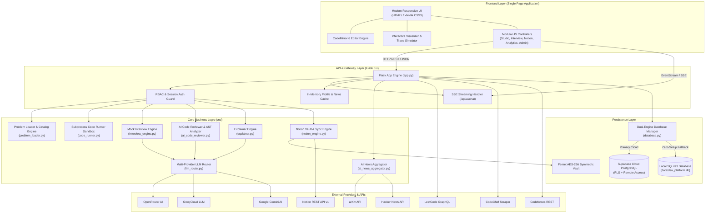
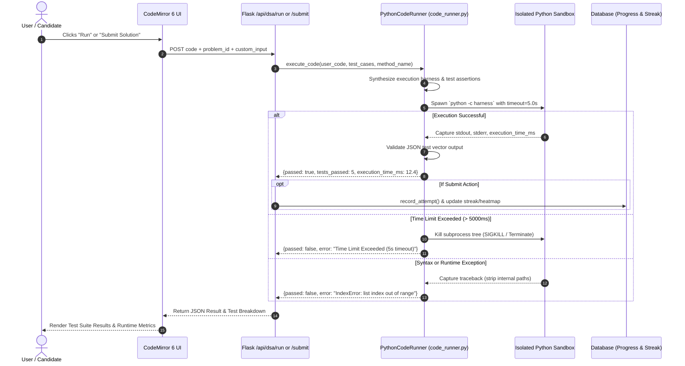
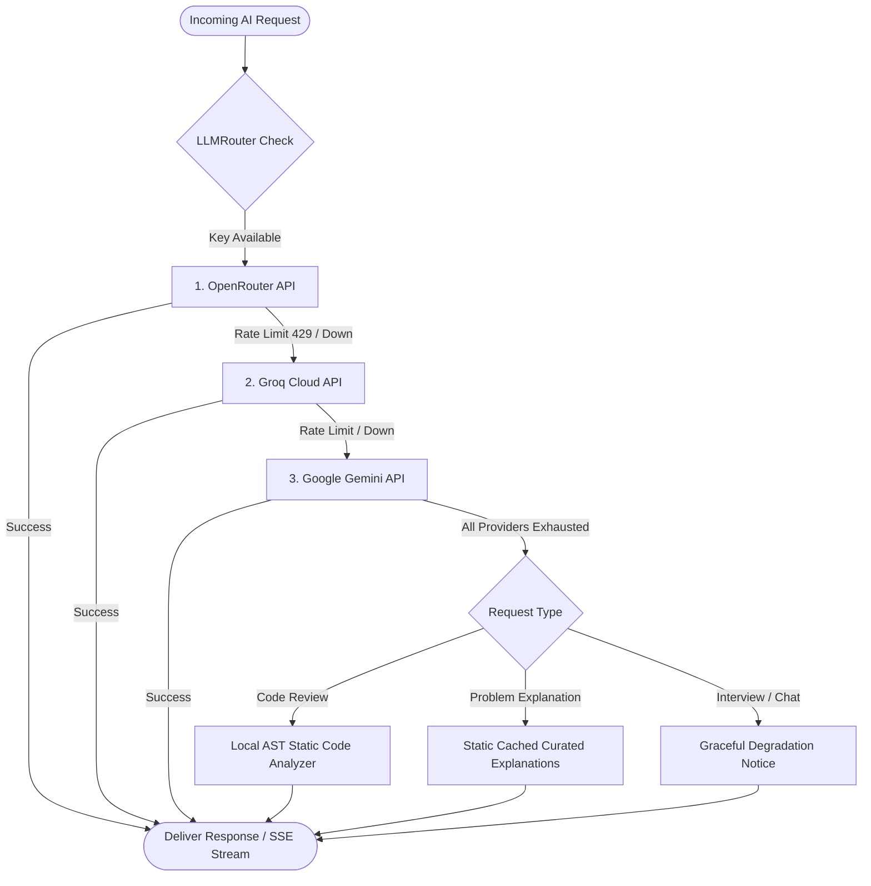
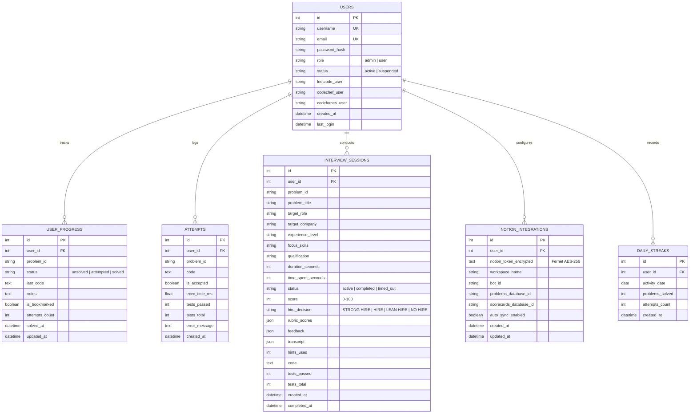
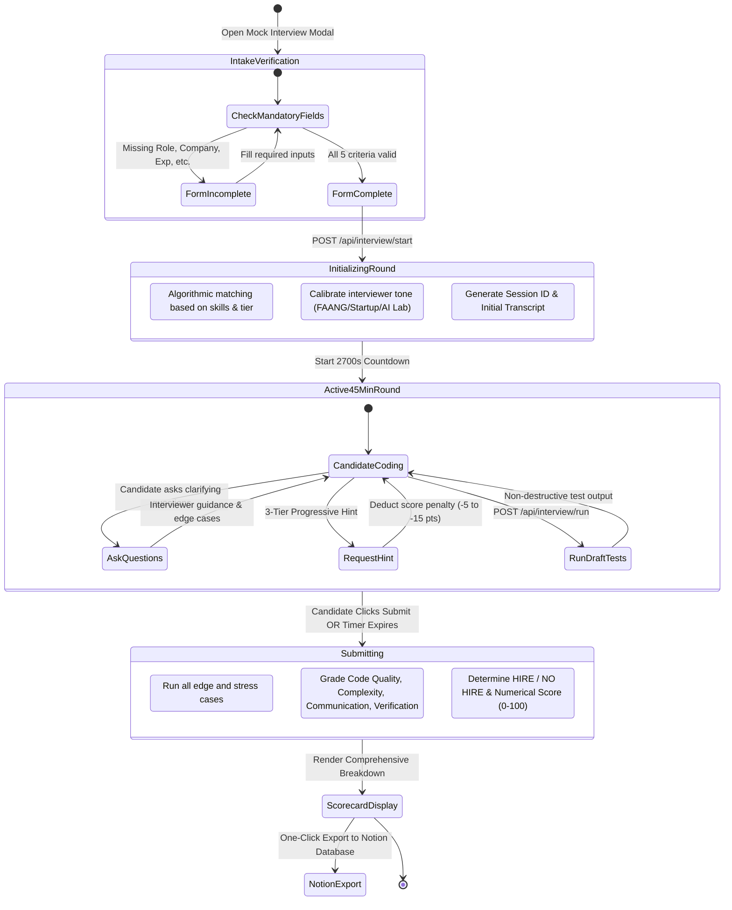

# ❄️ Brainfreeze Algos - Unified DSA & AI/ML Interview Studio

> **"Coding the Core of Cold Logic"**  
> A full-stack competitive programming ecosystem, algorithmic code studio, multi-platform analytics dashboard, and AI-powered 45-minute technical mock interview engine.

[](https://python.org)
[](https://flask.palletsprojects.com/)
[](https://codemirror.net/)
[](https://supabase.com/)
[](LICENSE)

---

## 📑 Table of Contents

1. [Platform Overview](#-platform-overview)
2. [Complete System Architecture](#-complete-system-architecture)
   - [High-Level Architecture](#high-level-architecture)
   - [Subprocess Code Runner Sandbox Architecture](#subprocess-code-runner-sandbox-architecture)
   - [Multi-Tier AI Routing Pipeline](#multi-tier-ai-routing-pipeline)
   - [Database Entity-Relationship (ER) Schema](#database-entity-relationship-er-schema)
   - [Timed Mock Interview Lifecycle](#timed-mock-interview-lifecycle)
3. [Key Modules & Capabilities](#-key-modules--capabilities)
   - [Inbuilt Python Code Studio & AST Reviewer](#1-inbuilt-python-code-studio--ast-reviewer)
   - [Algorithm Visualizer & Trace Simulator](#2-algorithm-visualizer--trace-simulator)
   - [45-Minute Timed Mock Interview Engine](#3-45-minute-timed-mock-interview-engine)
   - [Encrypted Multi-Tenant Notion Vault & Sync](#4-encrypted-multi-tenant-notion-vault--sync)
   - [Multi-Platform Competitive Analytics Hub](#5-multi-platform-competitive-analytics-hub)
   - [Streak Tracker & Daily Heatmap](#6-streak-tracker--daily-heatmap)
   - [Keyless Trending AI News Feed](#7-keyless-trending-ai-news-feed)
4. [Project Directory Structure](#-project-directory-structure)
5. [Complete REST & Streaming API Catalog](#-complete-rest--streaming-api-catalog)
6. [Technology Stack](#-technology-stack)
7. [Installation & Setup Guide](#-installation--setup-guide)
8. [Production Deployment](#-production-deployment)
9. [Security, Sandboxing & Data Privacy](#-security-sandboxing--data-privacy)

---

## 🌟 Platform Overview

**Brainfreeze Algos** bridges the gap between traditional competitive programming platforms and modern AI/ML technical interview preparation. It consolidates:
- **340+ Curated Problems**: Covering Striver’s A2Z DSA Sheet and specialized AI/ML algorithms (Tensor operations, Attention mechanisms, Backpropagation, Gradient Descent, KNN, K-Means, etc.).
- **In-Browser IDE**: Powered by CodeMirror 6 with custom syntax bundles, indentation rules, and live theme switching.
- **Sandboxed Execution**: Subprocess-isolated test execution with millisecond timers, memory limits, and structured assertion reporting.
- **Autonomous AI Interviewer**: A stateful 45-minute technical round with dynamic candidate profiling, progressive hints with scoring penalties, live feedback, and FAANG-calibrated rubric scorecards.
- **Dual-Engine Persistence**: Cloud-native Supabase PostgreSQL with local zero-config SQLite3 fallback.

---

## 🏛️ Complete System Architecture

### High-Level Architecture

The platform follows a modular, service-oriented monolithic architecture built on Flask, decoupled frontend modules, isolated worker sub-processes, and external SaaS integrations.



---

### Subprocess Code Runner Sandbox Architecture

To ensure safety, prevent memory leaks, and isolate user code execution, code is run via an ephemeral Python subprocess managed by [`PythonCodeRunner`](file:///c:/Users/abhoyar/OneDrive%20-%20Nice%20Software%20Solutions/Desktop/DSA%20Project/src/code_runner.py).



---

### Multi-Tier AI Routing Pipeline

AI features (Ask AI Mentor, AI Code Review, Mock Interview Dialogue, Hint Generation, and Step Explanations) are powered by a resilient, multi-provider cascading router:



---

### Database Entity-Relationship (ER) Schema

The persistence layer supports both **Supabase PostgreSQL** and **SQLite3**, structured identically for zero-code migration:



---

### Timed Mock Interview Lifecycle

The interview engine executes a stateful 45-minute simulation mimicking top-tier FAANG/AI company hiring rounds:



---

## 🚀 Key Modules & Capabilities

### 1. 💻 Inbuilt Python Code Studio & AST Reviewer
- **CodeMirror 6 Editor**: Includes auto-closing brackets, syntax error lints, Python indentation rules, and live dark/light palette switching.
- **Shortcuts**:
  - `Ctrl + Enter` : Run tests against sample vectors or custom input.
  - `Ctrl + Shift + Enter` : Submit solution to the official evaluator.
- **AI Code Reviewer & Big-O Analyzer**:
  - Evaluates time and space complexity with theoretical proof.
  - Detects anti-patterns (e.g., redundant allocations, unhandled nulls, nested lookups).
  - Offers a one-click **"Apply to Editor"** button to replace user code with the refactored version.
  - Features an **AST Static Fallback Engine** (`ast.parse`) that works completely offline if AI keys are unavailable.

### 2. 🔍 Algorithm Visualizer & Trace Simulator
- Interactive execution visualizer supporting step-by-step memory pointer inspection.
- Visual animations for:
  - Two-pointer techniques and sliding windows.
  - Binary search lower/upper bound divisions.
  - Tree traversals (In-order, Pre-order, Post-order, Level-order).
  - Graph traversals (BFS, DFS, Dijkstra).
  - Dynamic programming state matrices.

### 3. ⏱️ 45-Minute Timed Mock Interview Engine
- **Strict Intake Validation**: Requires target role (e.g., *GenAI Engineer, Machine Learning Engineer, SDE-2*), target company tier, experience level, focus topics, and qualifications before starting.
- **Live 45-Minute Stopwatch**: Pausable with time-spent telemetry.
- **3-Tier Progressive Hint System**:
  - *Tier 1: High-level conceptual nudge* (-5 pts)
  - *Tier 2: Data structure & algorithmic strategy* (-10 pts)
  - *Tier 3: Pseudocode & invariant outline* (-15 pts)
- **FAANG Calibrated Grading Rubric**:
  1. Problem Solving & Approach (25 pts)
  2. Code Quality & Correctness (25 pts)
  3. Time & Space Complexity (25 pts)
  4. Communication & Verification (25 pts)

### 4. 🔒 Encrypted Multi-Tenant Notion Vault & Sync
- Allows users to sync their solved solutions, personal notes, and interview scorecards directly to their personal Notion workspace.
- **Zero-Setup Auto-Provisioning**: Automatically creates two structured database views in Notion:
  1. `DSA Studio: Solved Problems & Solutions`
  2. `Technical Interviews: Scorecards & Rubrics`
- **Security**: Notion API tokens are encrypted at rest using AES-256 Fernet symmetric cryptography (`NotionVault`).

### 5. 🌐 Multi-Platform Competitive Analytics Hub
- **LeetCode**: Solved distribution (Easy, Medium, Hard), contest rating, global ranking, badges, and topic tag clouds via the official GraphQL interface.
- **CodeChef**: Div ranking (Div 1–4), Star ratings (**1★ to 7★**), current & peak ratings, contest history via resilient web scrapers.
- **Codeforces**: Official rank titles (*Candidate Master, Grandmaster, etc.*), contest rating curves, problem stats via official REST endpoints.
- **In-Memory TTL Caching**: Reduces redundant outbound HTTP calls and prevents third-party IP rate limiting.

### 6. 🔥 Streak Tracker & Daily Heatmap
- Tracks daily practice habits with an animated streak flame counter.
- Generates a GitHub-style calendar contribution heatmap logging problems solved per calendar day.
- Granular progress bars tracking completion percentages for each of the 18 curriculum steps.

### 7. 📰 Keyless Trending AI News Feed
- Aggregates recent pre-prints from **arXiv (cs.AI, cs.LG, cs.CL, stat.ML)** and high-ranking discussions from **Hacker News**.
- Operates out of the box with zero API keys required, with an in-memory 1-hour TTL cache.

---

## 📂 Project Directory Structure

```
DSA Project/
├── .env                              # Active environment variables (gitignored)
├── .env.example                      # Documented configuration template
├── requirements.txt                  # Python dependencies
├── package.json                      # Build manifest for CodeMirror 6
├── package-lock.json                 # Dependency lockfile
├── app.py                            # Primary Flask application and route definitions
├── serve.py                          # Production entry point (Waitress WSGI)
├── main.py                           # Standalone terminal CLI runner
├── README.md                         # Project documentation and architecture guide
│
├── scripts/
│   ├── build_codemirror_bundle.mjs   # Node/esbuild bundler for CodeMirror 6
│   ├── codemirror_bundle_entry.js    # Entry file re-exporting CodeMirror modules
│   ├── migrate_to_supabase.py        # Automated SQLite -> Supabase migration utility
│   ├── supabase_schema.sql           # Complete PostgreSQL DDL, RLS policies, & triggers
│   └── build_aiml_curriculum.py      # Dataset compilation script for AI/ML tracks
│
├── src/
│   ├── __init__.py                   # Package initialization
│   ├── database.py                   # Dual-engine DB manager (Supabase / SQLite3)
│   ├── problem_loader.py             # 340+ problem catalog indexer & filter
│   ├── problem_details.py            # Problem signatures, enrichments, & test suites
│   ├── code_runner.py                # Isolated subprocess test runner & sandbox
│   ├── llm_router.py                 # Multi-provider LLM cascade (OpenRouter -> Groq -> Gemini)
│   ├── explainer.py                  # Step-by-step algorithmic breakdown generator
│   ├── ai_code_reviewer.py           # Big-O analyzer & AST static code validator
│   ├── interview_engine.py           # Mock interview matcher, dialogue, hints, & grading
│   ├── notion_engine.py              # Notion REST client, schema provisioner, & Fernet vault
│   ├── ai_news_aggregator.py         # Keyless arXiv & Hacker News feed aggregator
│   ├── leetcode_client.py            # LeetCode GraphQL client
│   ├── codechef_client.py            # CodeChef profile scraper
│   ├── codeforces_client.py          # Codeforces API consumer
│   └── dashboard.py                  # Terminal Rich UI dashboard
│
├── templates/
│   └── index.html                    # Single Page Application HTML shell
│
├── static/
│   ├── css/
│   │   └── style.css                 # Responsive CSS design system (Dark/Light themes)
│   └── js/
│       ├── app.js                    # Core bootstrap, session handling, & theme switcher
│       ├── vendor/
│       │   └── codemirror-bundle.js  # Compiled local CodeMirror 6 bundle
│       └── modules/
│           ├── auth.js               # Auth modals, registration, & login flows
│           ├── admin.js              # Admin command center & user moderation
│           ├── studio.js             # Problem workspace, run/submit, notes, bookmarks
│           ├── editor.js             # CodeMirror 6 configuration & key bindings
│           ├── interview.js          # Mock interview intake, chat, timer, & scorecard
│           ├── notion.js             # Notion integration settings & manual sync
│           ├── visualizer.js         # Algorithmic visualizer canvas & animations
│           ├── trace_simulator.js    # Step-by-step pointer & variable state tracker
│           ├── tracker.js            # Heatmap rendering & streak calculations
│           ├── analytics.js          # Multi-platform CP profile integration
│           ├── ai.js                 # AI mentor chat & trending news feed
│           ├── nav.js                # View routing & navigation handlers
│           └── utils.js              # DOM helpers, formatters, & toast notifications
│
└── data/
    ├── dsa_platform.db               # Local SQLite database file
    ├── dsa_problems.json             # Problem curriculum cache
    └── dsa_explanations.json         # Permanent AI explanation cache
```

---

## 📡 Complete REST & Streaming API Catalog

### 🔐 Authentication & Session
| Method | Endpoint | Access | Description |
| :--- | :--- | :--- | :--- |
| `POST` | `/api/auth/register` | Public | Register new user account (`user` role) |
| `POST` | `/api/auth/login` | Public | Authenticate user via username/email & password |
| `POST` | `/api/auth/logout` | Public | Terminate session and clear cookies |
| `GET` | `/api/auth/me` | Public | Retrieve current session user payload & role |

### 🛡️ Admin Command Center
| Method | Endpoint | Access | Description |
| :--- | :--- | :--- | :--- |
| `GET` | `/api/admin/stats` | Admin | High-level system statistics and registration counters |
| `GET` | `/api/admin/users` | Admin | List all registered users with activity telemetry |
| `POST` | `/api/admin/user/<id>/role` | Admin | Elevate or demote user role (`admin` / `user`) |
| `POST` | `/api/admin/user/<id>/status`| Admin | Suspend or activate user account |

### 💻 DSA Studio & Code Execution
| Method | Endpoint | Access | Description |
| :--- | :--- | :--- | :--- |
| `GET` | `/api/dsa/steps` | User | Summary of all 18 curriculum steps with progress % |
| `GET` | `/api/dsa/problems` | User | Filter problems by step, difficulty, status, or search query |
| `GET` | `/api/dsa/problem/<id>`| User | Full problem specification, starter code, notes, & solution |
| `POST` | `/api/dsa/run` | User | Execute code against sample test cases or custom input |
| `POST` | `/api/dsa/submit` | User | Evaluate solution against all test vectors & update streak |
| `POST` | `/api/dsa/notes` | User | Save personal problem notes or toggle bookmark |
| `GET` | `/api/dsa/stats` | User | Retrieve streak, heatmap matrix, and difficulty counters |
| `GET` | `/api/dsa/explain/<id>`| User | Fetch AI-generated approach breakdown (cached) |
| `POST` | `/api/dsa/review` | User | Analyze user code for Big-O, anti-patterns, and refactors |

### ⏱️ Timed AI Mock Interview
| Method | Endpoint | Access | Description |
| :--- | :--- | :--- | :--- |
| `POST` | `/api/interview/start` | User | Validate intake criteria and initialize 45-min interview |
| `POST` | `/api/interview/chat` | User | Send chat message, pitch approach, or request progressive hints |
| `POST` | `/api/interview/run` | User | Run non-destructive test checks during interview |
| `POST` | `/api/interview/submit` | User | Finalize interview, execute full grading rubric, & save scorecard |
| `GET` | `/api/interview/history` | User | Retrieve past interview scorecards for current user |
| `GET` | `/api/interview/session/<id>`| User | Fetch specific interview session and transcript |

### 📓 Notion Integration
| Method | Endpoint | Access | Description |
| :--- | :--- | :--- | :--- |
| `GET` | `/api/notion/status` | User | Check connection status and provisioned database IDs |
| `POST` | `/api/notion/connect` | User | Validate token, auto-provision databases, and encrypt credentials |
| `POST` | `/api/notion/disconnect`| User | Remove Notion integration credentials |
| `POST` | `/api/notion/sync-problem` | User | Export solution code, notes, and complexity to Notion |
| `POST` | `/api/notion/sync-interview`| User | Export interview scorecard and transcript to Notion |
| `POST` | `/api/notion/toggle-autosync`| User | Toggle automatic synchronization preference |

### 🤖 AI Mentor & Competitive Analytics
| Method | Endpoint | Access | Description |
| :--- | :--- | :--- | :--- |
| `GET` | `/api/ai/status` | User | Check if multi-provider LLM backend is configured |
| `POST` | `/api/ai/chat` | User | **SSE Stream**: Ask AI mentor chat response |
| `GET` | `/api/ai/news` | User | Retrieve cached trending AI research and news feed |
| `GET` | `/api/leetcode/<handle>`| User | Fetch LeetCode solved counts, contest rating, and badges |
| `GET` | `/api/codechef/<handle>`| User | Fetch CodeChef rating, stars, division, and history |
| `GET` | `/api/codeforces/<handle>`| User | Fetch Codeforces rank title, rating, and max rating |

---

## 🛠️ Technology Stack

| Layer | Technology | Purpose |
| :--- | :--- | :--- |
| **Backend Framework** | [Flask 3.x](https://palletsprojects.com/p/flask/) | Core web server, REST API routing, session management |
| **WSGI Server** | [Waitress](https://docs.pylonsproject.org/projects/waitress/) | Production multi-threaded WSGI application server |
| **Language** | [Python 3.10+](https://python.org) | Backend logic, sandboxed code runner, and scrapers |
| **Code Editor** | [CodeMirror 6](https://codemirror.net/) | Modern web code editor with Python syntax highlighting |
| **Bundler** | [esbuild](https://esbuild.github.io/) | Compiles CodeMirror 6 packages into an offline bundle |
| **Database (Cloud)** | [Supabase](https://supabase.com/) | Cloud PostgreSQL with Row-Level Security (RLS) |
| **Database (Local)** | [SQLite3](https://sqlite.org/) | Zero-configuration local database fallback |
| **Encryption** | [Cryptography (Fernet)](https://cryptography.io/) | AES-256 symmetric encryption for API secrets at rest |
| **AI LLM Routing** | [OpenRouter](https://openrouter.ai/) / [Groq](https://groq.com/) / [Gemini](https://ai.google.dev/) | Multi-provider fallback cascade for chat, reviews, and grading |
| **Scraping & Requests** | [curl_cffi](https://github.com/yifeikong/curl_cffi) / [BeautifulSoup4](https://www.crummy.com/software/BeautifulSoup/) | Bypasses TLS fingerprinting for competitive platform profiles |
| **Frontend Architecture**| Vanilla ES6 Modules & Vanilla CSS3 | Zero-framework, high-performance UI with custom design tokens |

---

## ⚙️ Installation & Setup Guide

### Prerequisites
- **Python 3.10** or higher installed.
- **Node.js 18+** & npm (only required if rebuilding the CodeMirror bundle).
- **Git** for version control.

### Step 1: Clone the Repository
```bash
git clone https://github.com/your-username/brainfreeze-algos.git
cd "DSA Project"
```

### Step 2: Set Up Python Virtual Environment

**On Windows (PowerShell):**
```powershell
python -m venv venv
.\venv\Scripts\Activate.ps1
```

**On Linux / macOS:**
```bash
python3 -m venv venv
source venv/bin/activate
```

### Step 3: Install Dependencies
```bash
pip install -r requirements.txt
```

### Step 4: Configure Environment Variables
Copy `.env.example` to `.env`:
```powershell
cp .env.example .env
```
Edit `.env` with your desired configuration:
```ini
# Flask Secret Key
SECRET_KEY=your-super-secret-hex-key-here

# AI Providers (At least one recommended; app gracefully degrades if absent)
OPENROUTER_API_KEY=sk-or-v1-...
GROQ_API_KEY=gsk_...
GEMINI_API_KEY=AIzaSy...

# Optional: Supabase PostgreSQL (Falls back to local SQLite if left blank)
SUPABASE_URL=https://your-project.supabase.co
SUPABASE_KEY=your-supabase-anon-or-service-role-key

# Optional: Default Platform Usernames
LEETCODE_USERNAME=lee215
CODECHEF_USERNAME=tourist
CODEFORCES_USERNAME=tourist
```

### Step 5: (Optional) Rebuild CodeMirror 6 Bundle
The compiled bundle is pre-built in `static/js/vendor/codemirror-bundle.js`. If you modify any editor extensions in `scripts/`:
```bash
npm install
npm run build:editor
```

### Step 6: Start the Development Server
```bash
python app.py
```
Access the application at: **`http://127.0.0.1:5000`**

Default Admin Credentials (seeded on first run):
- **Username**: `admin`
- **Password**: `admin123`

---

## 🚀 Production Deployment

Do **not** use `python app.py` (Flask development server) in production environments. Run the pre-configured production server powered by Waitress:

```powershell
python serve.py
```

### Production Checklist:
1. **Secret Key**: Generate a cryptographically secure key:
   ```bash
   python -c "import secrets; print(secrets.token_hex(32))"
   ```
   Set this value as `SECRET_KEY` in `.env`.
2. **Admin Password**: Immediately change the default admin password via the admin console or database.
3. **Debug Flag**: Verify `FLASK_DEBUG=false` in `.env`.
4. **Database**: If deploying to a multi-instance cloud environment (e.g., Render, Railway, AWS ECS), connect **Supabase** by running the migration script:
   ```bash
   python scripts/migrate_to_supabase.py
   ```

---

## 🛡️ Security, Sandboxing & Data Privacy

1. **Subprocess Isolation**:
   - User-submitted Python solutions are executed in a sandboxed subprocess via `code_runner.py`.
   - Strict 5.0-second execution timeouts prevent `while True:` infinite loops and fork-bombs.
   - Traceback sanitizer strips host filesystem paths before sending errors to the frontend.
2. **Encrypted Credentials Vault**:
   - External service tokens (such as Notion integration tokens) are encrypted before insertion into the database using Fernet symmetric encryption (`cryptography` library) derived from `SECRET_KEY`.
3. **Password Hashing**:
   - All user passwords are salted and hashed using Werkzeug's `scrypt` / `pbkdf2:sha256` implementation.
4. **Session Security & RBAC**:
   - HTTP session cookies are cryptographically signed.
   - Strict decorator guards (`@login_required`, `@admin_required`) prevent privilege escalation and protect user-scoped resources.
5. **Browser Cache Hardening**:
   - Dynamic API endpoints set `Cache-Control: no-cache, no-store, must-revalidate` headers to prevent sensitive data caching on shared workstations.

---

## 📄 License

This project is licensed under the **MIT License**. See the `LICENSE` file for details.

Developed with ❄️ by the **Brainfreeze Algos Team**. Happy coding!
